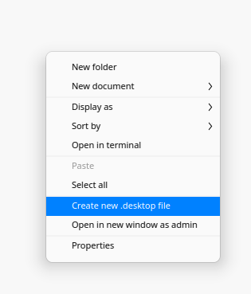

# dde-appknitter

## [EN]

Start a .desktop file wizard from the right-click menu, to automatically create icon launchers for your executables (appimages, shell scripts, binaries etc).

**NOTE:** This app is intended for DeepinOS v20 and up. For now, it only supports english and spanish environments.

## [ES]

Inicializa un asistente para la creación de archivos .desktop de tus ejecutables (appimages, shell scripts, binarios etc) para ser    integrados al lanzador de aplicaciones de forma automatica; desde el menu de click derecho.

**NOTA:**  Esta app esta hecha para correr en DeepinOS v20 en adelante. Por ahora, solo soporta entornos en ingles y español.

## [zh_CN]

　　通过右键菜单启动 .desktop 创建向导。

　　**提示：**此软件适用与深度操作系统20版。
